# Olá  Bem vindo ao repositório do projeto **One For All** ⚔️!

### Esse foi o segundo projeto utilizando os comandos do MySQL. Fizemos esse projeto na trybe com o intuito de praticar os comando avançados do MySQL, como o `INNER JOIN` e o `HAVING`. Além disso, normalizando e criando uma tabela inteira.
---

<h2><strong>Orientações:</strong></h2>

<h3><strong>Tecnologias utilizada:</strong></h3>

> MySQL
> 

<details>
  <summary><strong>Como clonar os arquivos 📝</strong></summary>
  
<h3>
  Para que essa aplicação funcione na sua máquina, será necessário seguir os seguintes passos:
  
  * 1 - Abra o CMD/terminal de comando do seu sistema através da pesquisa e faça os seguintes passo:
  
    - Se você utiliza `linux` ou `mac` em português, digite `cd Área\ de\ Trabalho` e em seguida `mkdir project-one-for-all` para que seja criada a pasta onde você fará o clone do projeto. Essa pasta será criada na tela inicial;
    - Caso utilize o `windows` ou o linux e mac em inglês, digite `cd desktop` e em seguida `mkdir project-all-for-one` para que seja criada a pasta onde você fará o clone do projeto. Essa pasta assim como da outra forma, será criada na tela inicial;
  
  * 2 - Em seguida utilize o comando `cd project-one-for-all` para entrar na pasta criada
  
  * 3 - Dentro da pasta, no terminal, utilize o comando `git clone git@github.com:PedrHenrick/Project-One-For-All.git` para clonar a pasta do repositório
  
  * 4 - Logo depois entre na pasta clonada utilizando o comando `cd Project-One-For-All/`
  
  E pronto! Já temos nossa aplicação na sua máquina. Agora você já pode fechar o terminal e abrir a pasta que está na área de trabalho e em seguida a pasta com o nome do projeto, lá você verá arquivos com o nome `desafioX.sql` onde `X` é o número dos exercícios listados no tópico <a href="#desafios">desafios</a>.
  </h3>
  <br />
</details>

<details>
  <summary><strong>O que fazer quando encontrar erros 🚫</strong></summary>
  <h3>
    Caso encontre algum erro referente a sintaxe ou funcionamento do mesmo, abra uma `Issue`
  </h3>
  
  * <h3>1 - Para iniciarmos, clique em <strong>issues</strong> como na foto abaixo:</h3>
  
    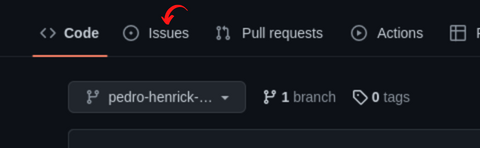
  
  * <h3>2 - Após isso, clique em <strong>new issue:</strong></h3>
  
    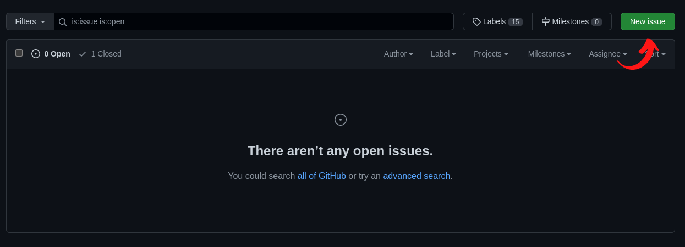
  
  * <h3>3 - Agora adicione um título sobre problema encontrado, adicione uma descrição mostrando como ocorreu o erro e por fim clique no botão <strong>submit new issue</strong>:</h3>
  
    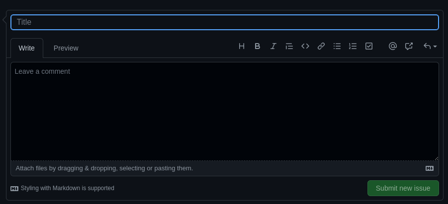
  
  * <h3>E pronto, o problema já foi documentado e será resolvido o mais rápido possível.</h3>
  
    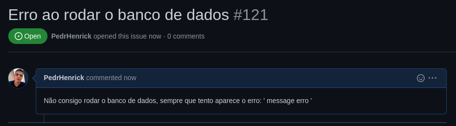
  
  <h3>Temos também a opção de utilizar o <a href="#form">formulário de feedback</a> encontrado no fim desse arquivo!!</h3>
  <br />
</details>
<details>
  <summary><strong>O que fazer após o code-review ✅</strong></summary>
  <h3>
    Após o seu review sobre tudo o que foi abordado, deixo como sugestão responder este <span id="form"><a href="https://forms.gle/ZJjEZNEAuc9QUauY9" target="_blank">formulário de feedback</a></span>, desenvolvido por mim para auxiliar na melhoria desse e de outros projetos.
  </h3>
  <h3>
    Aguardo sua resposta, obrigado!
  </h3>
</details>

---

<h2><span id="desafios"><strong>Desafios:</strong></span></h2>

**## Desafio 1**

- Crie um banco com o nome de **`SpotifyClone`**, normalizando a tabela encontrada no arquivo [SpotifyClone-Non-NormalizedTable](./SpotifyClone-Non-NormalizedTable.xlsx).
- Salve as queries criadas no arquivo *`desafio1.sql`*.

<details>

<summary><strong>👇 Seu código deverá ser similar ao seguinte</strong></summary><br />

```sql

DROP DATABASE IF EXISTS SpotifyClone;

CREATE DATABASE SpotifyClone;

CREATE TABLE SpotifyClone.tabela1(

coluna1 tipo restricoes,

coluna2 tipo restricoes,

colunaN tipo restricoes,

) engine = InnoDB;

CREATE TABLE SpotifyClone.tabela2(

coluna1 tipo restricoes,

coluna2 tipo restricoes,

colunaN tipo restricoes,

) engine = InnoDB;

INSERT INTO SpotifyClone.tabela1 (coluna1, coluna2)

VALUES

('exemplo de dados 1', 'exemplo de dados A'),

('exemplo de dados 2', 'exemplo de dados B'),

('exemplo de dados 3', 'exemplo de dados C');

INSERT INTO SpotifyClone.tabela2 (coluna1, coluna2)

VALUES

('exemplo de dados 1', 'exemplo de dados X'),

('exemplo de dados 2', 'exemplo de dados Y');

```

</details>


**## Desafio 2**

Crie uma *`QUERY`* que exiba três colunas:

1. A primeira coluna deve exibir a quantidade total de canções. Dê a essa coluna o alias "****cancoes****".

2. A segunda coluna deve exibir a quantidade total de artistas e deverá ter o alias "****artistas****".

3. A terceira coluna deve exibir a quantidade de álbuns e deverá ter o alias "****albuns****".

<details>

<summary><strong>➕ Informações complementares</strong></summary><br />

Sua *`QUERY`* deve retornar a seguinte informação:

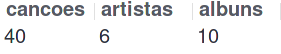
</details>

**## Desafio 3**

Crie uma *`QUERY`* que deverá ter apenas três colunas:

1. A primeira coluna deve possuir o alias "****usuario****" e exibir o nome da pessoa usuária.

2. A segunda coluna deve possuir o alias "****qtde_musicas_ouvidas****" e exibir a quantidade de músicas ouvida pela pessoa com base no seu histórico de reprodução.

3. A terceira coluna deve possuir o alias "****total_minutos****" e exibir a soma dos minutos ouvidos pela pessoa usuária com base no seu histórico de reprodução.

Os resultados devem estar agrupados pelo nome da pessoa usuária e ordenados em ordem alfabética.

<details>

<summary><strong>➕ Informações complementares</strong></summary><br />

Sua *`QUERY`* deve retornar a seguinte informação:

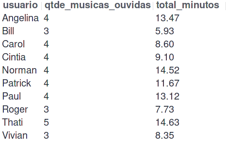
</details>

**## Desafio 4**

Crie uma *`QUERY`* que deve mostrar as pessoas usuárias que estavam ativas no ano de ****2021**** se baseando na data mais recente no histórico de reprodução.

1. A primeira coluna deve possuir o alias "****usuario****" e exibir o nome da pessoa usuária.

2. A segunda coluna deve ter o alias "****condicao_usuario****" e exibir se a pessoa usuária está ativa ou inativa.

O resultado deve estar ordenado em ordem alfabética.

<details>

<summary><strong>➕ Informações complementares</strong></summary><br />

Sua *`QUERY`* deve retornar a seguinte informação:

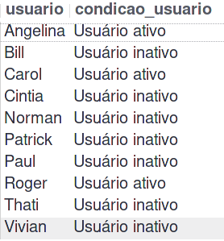
</details>

**## Desafio 5**

Estamos fazendo um estudo das músicas mais tocadas e precisamos saber quais são as duas músicas mais tocadas no momento. Crie uma *`QUERY`* que possua duas colunas:

1. A primeira coluna deve possuir o alias "****cancao****" e exibir o nome da canção.

2. A segunda coluna deve possuir o alias "****reproducoes****" e exibir a quantidade de pessoas que já escutaram a canção em questão.

Seu resultado deve estar ordenado em ordem decrescente, baseando-se no número de reproduções. Em caso de empate, ordene os resultados pelo nome da canção em ordem alfabética. Queremos apenas o top 2 de músicas mais tocadas.

<details>

<summary><strong>➕ Informações complementares</strong></summary><br />

Sua *`QUERY`* deve retornar a seguinte informação:

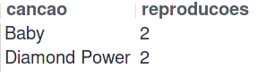
</details>

**## Desafio 6**

Tendo como base o valor dos planos e o plano que cada pessoa usuária cadastrada possui no banco, queremos algumas informações sobre o faturamento da empresa. Crie uma *`QUERY`* que deve exibir quatro dados:

1. A primeira coluna deve ter o alias "****faturamento_minimo****" e exibir o menor valor de plano existente para uma pessoa usuária.

2. A segunda coluna deve ter o alias "****faturamento_maximo****" e exibir o maior valor de plano existente para uma pessoa usuária.

3. A terceira coluna deve ter o alias "****faturamento_medio****" e exibir o valor médio dos planos possuídos por pessoas usuárias até o momento.

4. Por fim, a quarta coluna deve ter o alias "****faturamento_total****" e exibir o valor total obtido com os planos possuídos por pessoas usuárias.

Para cada um desses dados, por se tratarem de valores monetários, deve-se arredondar o faturamento usando apenas duas casas decimais.

<details>

<summary><strong>➕ Informações complementares</strong></summary><br />

Sua *`QUERY`* deve retornar a seguinte informação:

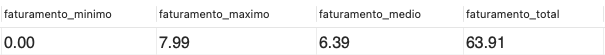
</details>

**## Desafio 7**

Mostre uma relação de todos os álbuns produzidos por cada pessoa artista, com a quantidade de seguidores que ela possui, de acordo com os detalhes a seguir. Para tal, crie uma *`QUERY`* com as seguintes colunas:

1. A primeira coluna deve exibir o nome da pessoa artista, com o alias "****artista****".

2. A segunda coluna deve exibir o nome do álbum, com o alias "****album****".

3. A terceira coluna deve exibir a quantidade de pessoas seguidoras que aquela pessoa artista possui e deve possuir o alias "****seguidores****".

Seus resultados devem estar ordenados de forma decrescente, baseando-se no número de pessoas seguidoras. Em caso de empate no número de pessoas, ordene os resultados pelo nome da pessoa artista em ordem alfabética e caso há artistas com o mesmo nome, ordene os resultados pelo nome do álbum alfabeticamente.

<details>

<summary><strong>➕ Informações complementares</strong></summary><br />

Sua *`QUERY`* deve retornar a seguinte informação:

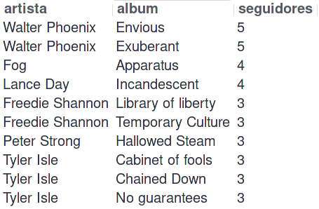
</details>

**## Desafio 8**

Mostre uma relação dos álbuns produzidos por um artista específico, neste caso *`"Walter Phoenix"`*.

Para isto crie uma *`QUERY`* que o retorno deve exibir as seguintes colunas:

1. O nome da pessoa artista, com o alias "****artista****".

2. O nome do álbum, com o alias "****album****".

Os resultados devem ser ordenados pelo nome do álbum em ordem alfabética.

<details>

<summary><strong>➕ Informações complementares</strong></summary><br />

Sua *`QUERY`* deve retornar a seguinte informação:

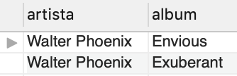
</details>

**## Desafio 9**

Crie uma *`QUERY`* que exibe a quantidade de músicas que estão presentes atualmente no histórico de reprodução de uma pessoa usuária específica. Para este caso queremos saber quantas músicas estão no histórico do usuário *`"Bill"`* e a consulta deve retornar a seguinte coluna:

1. O valor da quantidade, com o alias "****quantidade_musicas_no_historico****".

<details>

<summary><strong>➕ Informações complementares</strong></summary><br />

Sua *`QUERY`* deve retornar a seguinte informação:


</details>

**## Desafio 10**

Crie uma *`QUERY`* que exiba o nome e a quantidade de vezes que cada canção foi tocada por pessoas usuárias do plano gratuito ou pessoal de acordo com os detalhes a seguir:

- A primeira coluna deve exibir o nome da canção, com o alias "***nome****";
- A segunda coluna deve exibir a quantidade de pessoas que já escutaram aquela canção, com o alias "***reproducoes****";
- Seus resultados devem estar agrupados pelo nome da canção e ordenados em ordem alfabética.

<details>

<summary><strong>➕ Informações complementares</strong></summary><br />

Sua *`QUERY`* deve retornar a seguinte informação:

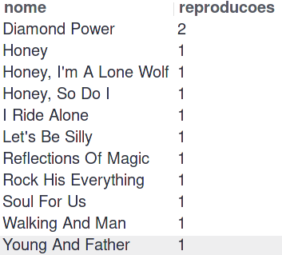
</details>

**## BÔNUS**

**### Desafio 11**

Crie uma *`QUERY`* que altere o nome de algumas músicas e as ordene em ordem alfabética com as colunas abaixo se baseando nos seguintes critérios:

1. O nome da música em seu estado normal com o alias ****nome_musica****

2. O nome da música atualizado com o alias ****novo_nome****

- ***Critérios****
- Trocar a palavra ***"Streets"**** no final do nome de uma música por ***"Code Review"****
- Trocar a palavra ***"Her Own"**** no final do nome de uma música por ***"Trybe"****
- Trocar a palavra ***"Inner Fire"**** no final do nome de uma música por ***"Project"****
- Trocar a palavra ***"Silly"**** no final do nome de uma música por ***"Nice"****
- Trocar a palavra ***"Circus"**** no final do nome de uma música por ***"Pull Request"****

<details>

<summary><strong>➕ Informações complementares</strong></summary><br />

Sua *`QUERY`* retornar a seguinte informação:

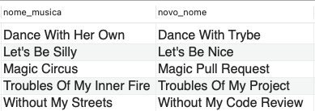
</details>
